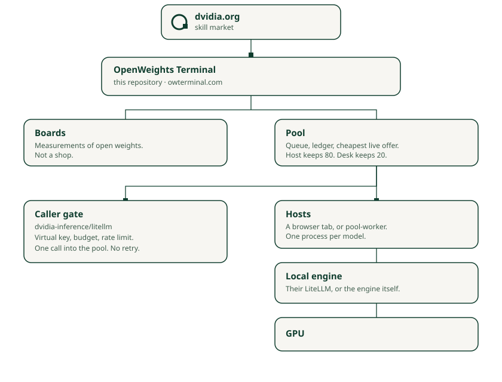

# Architecture



[dvidia.org](https://dvidia.org) is the house: an open marketplace for physical skills. [OpenWeights Terminal](https://owterminal.com) is a product of that house. It is the open-weights desk. It is not the skill library.

| Piece | Where | What it is |
|---|---|---|
| Desk | [Tarzelf/ow-terminal](https://github.com/Tarzelf/ow-terminal) | The site, the boards, the prices, the pool ledger, the job queue. |
| Host command | [dvidia-inference/ow](https://github.com/dvidia-inference/ow) | Looks at one computer. If LiteLLM is already running, it joins those models and stays open. |
| Caller gate | [dvidia-inference/litellm](https://github.com/dvidia-inference/litellm) | A virtual key, a budget, a rate limit. A different machine from the one that runs the model. |

```
dvidia.org
    |
OpenWeights Terminal
    |                 |
 boards            pool
                    |
         caller key ---- host running ow
                              |
                           LiteLLM
                           on that computer
```

## What is built

Boards rank a model on a chip by tokens per second. A number on the board is a quote. It is not a promise that your box will match it.

The pool is the other door. A person with a computer runs `ow`. The command reads the models LiteLLM already loaded, prints a four-letter code, and stays open. The desk shows that code as a row: ready or busy, a price per million tokens, a speed.

A caller uses a pool key. The desk holds the cheapest live machine for that model, then bills the tokens that came back. The host keeps 80 percent. The desk keeps 20. A payout address is shielded Zcash. The memo matches a quote. The words of the call are not in the memo.

The wire is HTTPS. The prompt goes to the desk, the host picks it up over HTTPS, and the host hands it to LiteLLM on `127.0.0.1`. That last hop does not leave the computer.

## What the desk keeps

The prompt sits in the database until a machine claims the job. The claim clears it. The answer sits there until the caller reads it. That read clears it. What remains is the bill: which key, which model, how many tokens. Not the text.

`ow` does not write the prompt or the answer to disk.

## What is not true yet

The desk can read the prompt during that short wait. TLS ends at the server. Encrypting the row so the desk cannot read it is the right next step, and it is not built. The caller would encrypt to the host's key. The desk would store ciphertext and hand it over. The host would decrypt, run the model, and encrypt the answer back.

Encrypting the prompt so the host cannot read it is not the plan. The host has to see the words to run the model. A chip that hides the job from its owner is a data-center feature, not a Spark on a desk.

LiteLLM on the host can still log a request unless that log is turned off. The desk does not control that disk.

Nothing here watches a chain. A memo becomes a balance only when the desk settles it. A payout leaves the queue only when the desk marks it sent.
