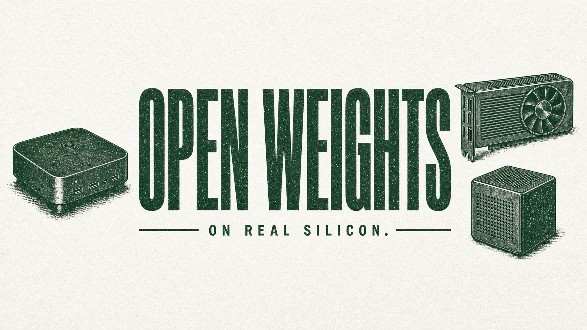

# OpenWeights Terminal

This is the OpenWeights essay, not a manifesto for [dvidia.org](https://dvidia.org). Dvidia is the house. This file is one product of that house: the desk at [owterminal.com/manifesto](https://owterminal.com/manifesto). The page and this repository say the same thing. If a sentence must change, change both.

- [English](essay/en.md)
- [Español](essay/es.md)
- [中文](essay/zh.md)
- [Architecture](ARCHITECTURE.md)

The architecture is not the essay. The essay is why the file has to stay copyable. The architecture is what this desk does today, and the one privacy line it does not claim yet.

`we <3 open weights.`
